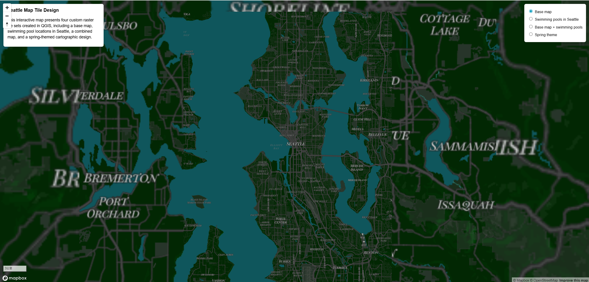
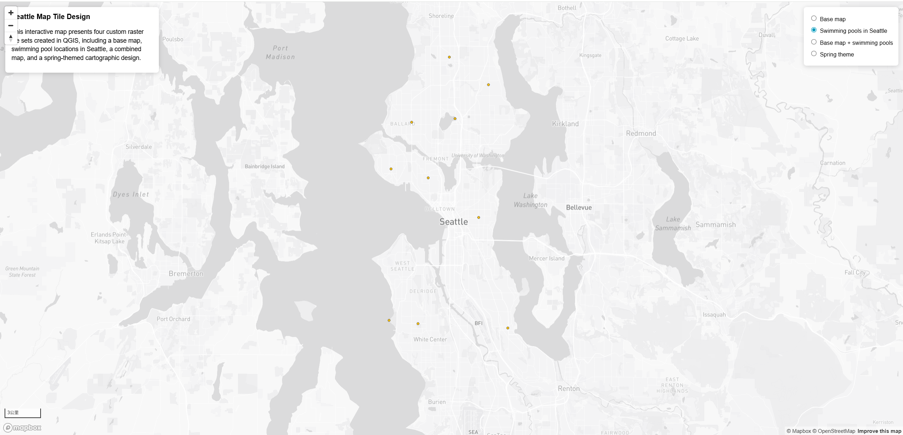
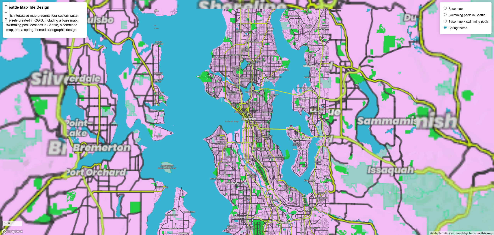

# GEOG 458 Lab 4 – Custom Map Tile Generation and Web Mapping

## Web Map URL
 **https://github.com/AllenVAL/Geog458TileSetPractice.git**

---

##  Study Area
The geographic focus of this project is **Seattle, Washington**, including the surrounding urban area.  
All tile sets were exported with a limited spatial extent to reduce file size and improve performance on GitHub Pages.

---

## Project Overview
This project demonstrates the creation of custom raster map tiles using **QGIS** and **QMetaTiles**, and the assembly of those tiles into an interactive **Mapbox GL JS** web map.

Four tile sets were created:
1. A customized **basemap**
2. A **thematic map** showing swimming pool locations
3. A **combined map** overlaying the thematic data on the basemap
4. A **spring-themed cartographic design**

All tile sets are visualized in a single full-screen web map with a layer switcher, scale bar, zoom controls, attribution, and map description.

---

## Tile Sets Overview

### Tile Set 1 – Base Map
- **Folder**: `assets/tileset1/`
- **Description**:  
  A monochrome basemap derived from Mapbox layers and refined in QGIS.  
  Colors, label fonts, and visual hierarchy were adjusted to maintain a clean and readable basemap suitable for overlaying thematic data.
- **Zoom Levels**: 3–14
### MAP 1

### Tile Set 2 – Swimming Pools in Seattle (Thematic Layer)
- **Folder**: `assets/tileset2_swimming_pools/`
- **Data Source**: Seattle Open Data (Swimming Pools point dataset)
- **Description**:  
  A thematic layer showing swimming pool locations in Seattle.  
  Points were styled with a high-contrast marker symbol to remain visible over a light basemap.
- **Zoom Levels**: 3–14
### MAP 2

### Tile Set 3 – Base Map + Swimming Pools (Combined)
- **Folder**: `assets/tileset3/`
- **Description**:  
  A combined tile set that merges the basemap (Tile Set 1) with the thematic swimming pool points (Tile Set 2).  
  This layer demonstrates how a contextual basemap supports interpretation of point-based features.
- **Zoom Levels**: 3–14
### MAP 3

### Tile Set 4 – Spring Theme (Cartographic Design)
- **Folder**: `assets/tileset4_spring_theme/`
- **Description**:  
  A spring-themed map design emphasizing bright and playful colors inspired by seasonal vegetation and fresh weather.  
  This tile set modifies map colors and styling to reflect a coherent visual theme.
- **Zoom Levels**: 3–14
### MAP 4

### References
  Seattle Open Data (2026). Swimming Pools dataset (Feature Service). City of Seattle. Retrieved from https://data-seattlecitygis.opendata.arcgis.com/datasets/19ccbdcca6384ad797dedae264c0ed8f_0/explore?location=47.643887%2C-122.294819%2C11

